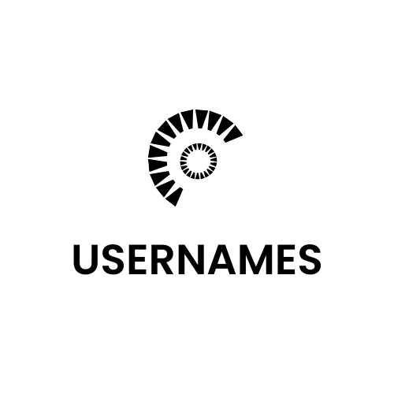

<p align="center">
    
</p>

<div align="center">


[](https://github.com/peteruche21/effective-broccoli/commits/master)
<!-- [](https://twitter.com/paymasters_io) -->

[Build](#build) •
[Test](#test) •
[Report a bug](https://github.com/peteruche21/effective-broccoli/issues/new)
• [Questions](https://github.com/peteruche21/effective-broccoli/)

**[usernames](#core)** is a domain name service built on the Mantle network that helps map human-readable names to wallet addresses and utilizes account abstraction and name hashes to create a novel user experience that mimics the concepts of usernames on web2 (gasless interactions, logins with subdomains, focus on subdomains for Dapks).

</div>

It is an **EXPERIMENT** that allows for the use of domain names to create a login system that emulates the web2 login system with [EIP-4337](https://eips.ethereum.org/EIPS/eip-4337). It consists of an [ENS](ens.domains) implementation on the Mantle L2 Network, whereby a paymaster doubles as a registrar and a paymaster. giving name owners the ability to sponsor/subsidize transactions of users owning their sub-domains.

# Dart

Mobile First Implementation.
Please refer to [packages/dart](./packages/dart/)

# Core

Smart-contracts.
Please refer to [packages/core](./packages/core/)

## Global Paymaster

A global paymaster allows every account that owns an ENS Domain, (e.g. "**usernames.bit**" ) to sponsor a user operation, each node (nameHash) has its corresponding balance in the paymaster.
Since Usernames are subdomains first, every user with a registered subdomain under a node, can consume the node's balances in the paymaster.

### Multi-Mode paymaster

It doesn't just allow a node to sponsor operations, it also allows a node to sponsor every operation. Allowing it to function as an ERC20 paymaster. the signature validation ranges from ZERO to TWO, where zero means, the operation can be paid for in ERC20 tokens without checking for a valid signer.
It allows the contract to work as:

- ERC20 paymaster when `sigCount` is set to `ZERO`
- Verifying Paymaster when `sigCount` != `ZERO`
- 2FA VerifyingPaymaster when `sigCount` == `TWO`
- Cross-Node gasless delegation when the address of `SecondarySigner` is set to a delegation signer.
- `FIFS` ENS Subdomain `Registrar` (guaranteeing a gasless **initial** operation which is primarily for name Registration)
  
### Paymaster as a Registrar

The paymaster inherits the FIFS registrar and is responsible for registering subdomains. It also uses ENS to restrict certain write operations to their corresponding node owners.
Every name owner must register the paymaster as an `Operator` for their node.

## Signature Verification

There are 3 signature verification paths:

1. `ZERO`: meaning, that a signature validation is not needed. But due to the [Cached Debt](#cached-debt) mechanism, it can allow for sending any initial transaction other than name registration, because the signer is not validating the transaction.
2. `ONE`: allows the validation of the signature of a verifying signer. Either the primary signer or the secondary signer can be used
3. `TWO`: allows two-factor validation. I.e. the **paymasterAndData** must be signed by two valid signatures in any order.

## Cached Debt

The paymaster caches userOp cost as **Debt** which must be paid in the next op. The paymaster guarantees a free initial operation to allow new users to register a username (subdomain name). The free transaction is only applied if the transaction being executed is a name registration (this is verified by the verifying signer).
however, the cost of this initial operation is not free, the user will be debited for it if the `postOp` does not revert.
if the `transferFrom` fails, then the gas cost will be **cached** and must be paid off in the next Op while ignoring the price volatility during that time.
This creates a situation where:

- Volatile ERC20s can be used, as the volatility is ignored in the cache
- The amount of Tokens calculated then will be the same paid now, even if the price is higher or lower.
- Token Price is not cached
- Oracle Conversions/ calls to oracles are not made in the `_validatePaymasterUserOp` step
- Token decimals are also not stored

## Usernames on Mantle

usernames on Mantle are NFTS, which allows you to connect with and link a name to a smart account or log in with a username, instead of the conventional connect wallet. You can have one wallet associated with a Dapk, or one wallet associated with multiple Dapks.

usernames are your web3 username, unique for every Dapk built on Mantle.

usernames are intended to be an infrastructure plugged into Dapks, ensuring a smoother web3 onboarding.

## DAPKs (Decentralized Mobile Apps)

### Login with subdomains

The name login flow is as follows:

- open a Dapk (decentralized mobile app)
- enter your username (e.g `Peter`)
- the system gets the full nameHash with the node represented by the app (e.g Peter.google.bit)
- resolve the name and try to log in the user
- if the resolved name is different from the account address destroy the session and prompt the user.
- if the name is not registered, ask the user to log in/create a new smart account and link the name to it, then login.
- encourage users to set up a backup (e.g with Google OAuth)

### Gasless name registration

when signing up a user for the first time into a Dapk, it is a constant that there is no name owned yet.
It is also possible that the user is a first-timer with no balance.
When a user is prompted to create a smart account and link:

- the system sets up a new account, registers the provided name, with the address of the new account
- caches the operation cost in the paymaster to be paid by the user when trying to send another operation.
- logs the user in

## How It Works

## Getting Started

### Prerequisites

Please install the following:

- [Git](https://git-scm.com/book/en/v2/Getting-Started-Installing-Git)
- [pnpm](https://pnpm.io/installation)
- [Foundry / Foundryup](https://github.com/gakonst/foundry)
  - This will install `forge`, `cast`, and `anvil`
  - You can run `forge --version` to verify your installation
  - To update, just run `Foundryup`
- [make](https://askubuntu.com/questions/161104/how-do-i-install-make)

### Installation

1. first, clone the repo

```sh
git clone https://github.com/peteruche21/effective-broccoli
```

2. install dependencies

```sh
pnpm install

# you have to specify the make target
# evm for non-native AA EVM chains
# zkevm for zksync-era
make install target=core
```

### Usage

The contracts were written in solidity version `0.8.17`

update the version in `foundry.toml` if you wish to use a different version. Note you would have to update all contracts.

#### update and modify lib

do not run `forge update` or `make-update` directly as this will bump `openzeppelin` version contracts to the `latest` which uses solidity version `^0.8.19`, the `Ownable` contract will cause you to modify contracts in the lib.

1. update your foundry installation

```sh
foundryup
```

2. update the ENS contracts

```sh
make update-ens target=core
```

#### generate nameHash

To deploy the Registrar controller, you have to provide the TLD domain name hash.

for `.bit`, run:

```sh
node namehash.js
```

Copy the `bytes32` output and replace the nameHash in [RegistrarController](./packages/core/src/registrars/UsernamesRegistrarController.sol#L153)
you can replace `.bit` in [namehash.js](namehash.js) with your TLD

### Testing

```sh
make test target=core
```

### Deployment

Deploy [scripts](https://book.getfoundry.sh/tutorials/solidity-scripting.html) have been written for you, unless you want to modify and deploy differently.

Currently, the mantle network does not support [EIP-1559](https://eips.ethereum.org/EIPS/eip-1559) transactions so make sure to use `deploy-legacy` which suffixes `--legacy` to the forge command
Also, `CREATE2 factory` is not available on the mantle test net, so do not use salted deployments in your scripts.

#### Setup

- rename `packages/*/.env.example` to `.env` and provide the required configurations
- `PRIVATE_KEY`: keep this out of GitHub
- `ETHERSCAN_API_KEY`: you can obtain this from [etherscan](https://etherscan.io)
- `<CHAIN>_RPC_URL`: most of the chains are pre-filled with their RPC provider URL if you are using a private node provider. please update it.
- also, you need to hold some Testnet tokens in the chain you are deploying to.
- go to [Mantle faucet](https://faucet.testnet.mantle.xyz/) to acquire testnet tokens

#### Deploying to a Network

```sh
make deploy-legacy target=core chain=<chain symbol> contract=<contract name>

## example: make deploy-legacy target=core chain=MANTLE contract=Paymaster
```

This will run the following inside the specified target

```sh
@forge script script/${contract}.s.sol:Deploy${contract}Script --rpc-url ${$(CHAIN)_RPC_URL}  --private-key ${PRIVATE_KEY} --legacy --broadcast -vvv
```

#### Locally

- To start a local network run:

```sh
make local
```

This boots up a local blockchain for you with a test private key;

- To deploy to the local network:

```sh
make deploy-local target=<target> contract=<contract name>

## example: make deploy-local target=core contract=Paymaster
```

#### Fork

You can also deploy on a forked network

- To start a forked network run:

```sh
make fork chain=<MANTLE || your_chain_name>

## example make fork chain=MANTLE
```

make sure to have the  `RPC_URL` of the chain specified in your `.env` file

- To deploy to a forked network
  
  Use the same command as `deploy-local`

### Prettier

To run prettier on the core package, run:

```sh
make format target=core
```

## Further Steps

1. To ENHANCE the **usernames** EXPERIMENT, we will look into using [webauthn](https://webauthn.guide/) and the **mobile secure enclave** as account signers, allowing for ZERO need of [JWT](https://jwt.io/) auths and abstract **login with a username** into a FRICTIONLESS and FAST experience.

2. Support Web Version

## Security

This framework comes with slither parameters, a popular security framework from [Trail of Bits](https://www.trailofbits.com/). To use Slither, you'll first need to [install Python](https://www.python.org/downloads/) and [install Slither](https://github.com/crytic/slither#how-to-install).

Optionally update the [slither.config.json](./packages/evm/slither.config.json)

Then, run:

```sh
# always specify a target if you are running `make` from the root folder
make slither target=core
```

## Contributing

Contributions are welcomed! Open a PR or an Issue!

## License

Licensed under combined MIT and Apache-2.0
